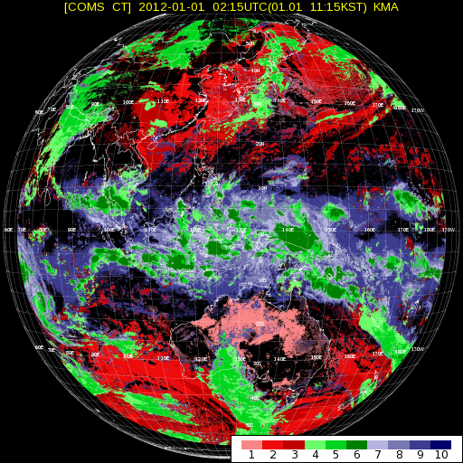
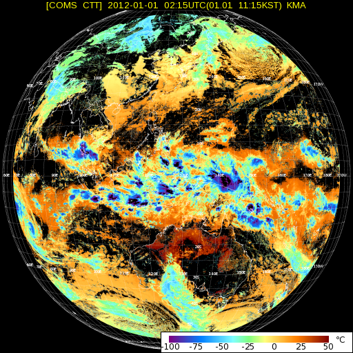

# :satellite: COMS-1 Meteorological Satellite Tools
COMS-1 is a geostationary meteorological satellite operated by the [Korean Meteorological Agency](http://www.kma.go.kr/eng/index.jsp)'s (KMA) [National Meteorological Satellite Center](http://nmsc.kma.go.kr/html/homepage/en/ver2/main.do) (NMSC). It is positioned at 128.15˚E and provides real-time meteorological data for most of Asia and Oceania.

It broadcasts meteorological data to end-users via two L-band (~1.69 GHz) downlinks:
- Low Rate Information Transmission (LRIT)
- High Rate Information Transmission (HRIT)

These downlinks can be received with an inexpensive hardware setup and some open-source software. This repo contains part of the software required for receiving these weather images.

**These tools are under active development and testing. They are not user-friendly and require commands to be run manually to get images. Once the code is bug-free and has been thoroughly tested I will automate the process and write a setup guide.**

More information can be found in [these blog posts on my site](https://vksdr.com/t/coms-1).

| Component     | Description   | Dependencies  |
| ------------- | ------------- | ------------- |
| [xrit-header.py](#xrit-headerpy) | Parses xRIT file and displays header information in a human-readable format. |  |
| [lrit-img.py](#lrit-imgpy) | Extracts Meteorological Imager data from LRIT Image (IMG) files. | Pillow (PIL) |
| [hrit-img.py](#hrit-imgpy) | Extracts Meteorological Imager data from HRIT Image (IMG) files. | Pillow (PIL) |
| [overlay.py](#overlaypy) | Adds overlays and text to COMS-1 Meteorological Imager images. | Pillow (PIL), pyshp |
| [lrit-additional.py](#lrit-additionalpy) | Extracts data from LRIT Additional Data (ADD) files. |  |
| [coms.py](coms.py) | Variables and methods for COMS-1 LRIT parsing. | jdcal |
| [keymsg-decrypt.py](#keymsg-decryptpy) | Decrypts KMA Encryption Key Message files for COMS-1 xRIT decryption | pyDes |

## xrit-header.py
Parses xRIT file and displays header information in a human-readable format.
```
usage: xrit-header.py [-h] PATH

Parses xRIT file and displays header information in a human-readable format.

positional arguments:
  PATH        Input xRIT file

optional arguments:
  -h, --help  show this help message and exit
```
<details>
<summary>Sample output</summary>

#### LRIT
```
python3.6 xrit-header.py samples/lrit/IMG_ENH_01_IR1_20120101_000920_01.lrit
[Type 000 : Offset 0x0000] Primary Header:
	Header length:         16 (0x10)
	File type:             0, Image data (IMG)
	Total header length:   4972 (0x136C)
	Data length:           3824184 (0x3A5A38)

[Type 001 : Offset 0x0010] Image Structure Header:
	Header length:         9 (0x9)
	Bits per pixel:        8 (0x8)
	Image:                 Extended Northern Hemisphere (ENH)
	  - Columns: 1547
	  - Lines:   309
	Compression:           0, None

[Type 002 : Offset 0x0019] Image Navigation Header:
	Header length:         51 (0x33)
	Projection:            Normalized Geostationary Projection (GEOS)
	Longitude:             128.2° E
	Column scaling factor: 8170135
	Line scaling factor:   4286797161
	Column offset:         773
	Line offset:           1010

[Type 003 : Offset 0x004C] Image Data Function Header:
	Header length:         4810 (0x12CA)
	Data Definition Block:
	  - dumped to "samples/lrit/IMG_ENH_01_IR1_20120101_000920_01_IDF-DDB.txt"

[Type 004 : Offset 0x1316] Annotation Header:
	Header length:         41 (0x29)
	Text data:             "IMG_ENH_01_IR1_20120101_000920_01.lrit"

[Type 005 : Offset 0x133F] Time Stamp Header:
	Header length:         10 (0xA)
	P Field:               01000000
	  - Extension flag:    0 (No extension)
	  - Time code ID:      100 (1958 January 1 epoch - Level 1 Time Code)
	  - Detail bits:       0000
	T Field:               010011010000101000000101000110001110111010000000
	  - Day counter:       19722 (31/12/2011 - DD/MM/YYYY)
	  - Milliseconds:      85520000 (23:45:20 - HH:MM:SS)

[Type 007 : Offset 0x1349] Key Header:
	Header length:         7 (0x7)
	Encryption key:        0x0 (disabled)

[Type 128 : Offset 0x1350] Image Segmentation Information Header:
	Header length:         7 (0x7)
	Segment number:        1 of 4
	Line num of image:     1

[Type 131 : Offset 0x1357] Image Observation Time Header:
	Header length:         21 (0x15)
	MJD:                   55926.989814814646
	Date:                  31/12/2011
	Time:                  0.989814814645797
```

#### HRIT
```
python3.6 xrit-header.py samples/hrit/IMG_FD_01_IR1_20120101_024020_01.hrit
[Type 000 : Offset 0x0000] Primary Header:
	Header length:         16 (0x10)
	File type:             0, Image data (IMG)
	Total header length:   19654 (0x4CC6)
	Data length:           12100000 (0xB8A1A0)

[Type 001 : Offset 0x0010] Image Structure Header:
	Header length:         9 (0x9)
	Bits per pixel:        16 (0x10)
	Image:                 Full Disk (FD)
	  - Columns: 2750
	  - Lines:   275
	Compression:           0, None

[Type 002 : Offset 0x0019] Image Navigation Header:
	Header length:         51 (0x33)
	Projection:            Normalized Geostationary Projection (GEOS)
	Longitude:             128.2° E
	Column scaling factor: 10212669
	Line scaling factor:   4284754627
	Column offset:         1374
	Line offset:           1374

[Type 003 : Offset 0x004C] Image Data Function Header:
	Header length:         19379 (0x4BB3)
	Data Definition Block:
	  - dumped to "samples/hrit/IMG_FD_01_IR1_20120101_024020_01_IDF-DDB.txt"

[Type 004 : Offset 0x4BFF] Annotation Header:
	Header length:         40 (0x28)
	Text data:             "IMG_FD_01_IR1_20120101_024020_01.hrit"

[Type 005 : Offset 0x4C27] Time Stamp Header:
	Header length:         10 (0xA)
	P Field:               01000000
	  - Extension flag:    0 (No extension)
	  - Time code ID:      100 (1958 January 1 epoch - Level 1 Time Code)
	  - Detail bits:       0000
	T Field:               010011010000101100000000011110111110011011000000
	  - Day counter:       19723 (01/01/2012 - DD/MM/YYYY)
	  - Milliseconds:      8120000 (02:15:20 - HH:MM:SS)

[Type 007 : Offset 0x4C31] Key Header:
	Header length:         7 (0x7)
	Encryption key:        0x0 (disabled)

[Type 128 : Offset 0x4C38] Image Segmentation Information Header:
	Header length:         7 (0x7)
	Segment number:        1 of 10
	Line num of image:     1

[Type 130 : Offset 0x4C3F] Image Compensation Information Header:
	Header length:         103 (0x67)
	COFF = 1.37450000000E+03
	CFAC = 1.02126690000E+07
	LOFF = 1.37450000000E+03
	LFAC = -1.02126690000E+07

[Type 131 : Offset 0x4CA6] Image Observation Time Header:
	Header length:         21 (0x15)
	MJD:                   55927.093981481623
	Date:                  01/01/2012
	Time:                  0.09398148162290454

[Type 132 : Offset 0x4CBB] Image Quality Information Header:
	Header length:         11 (0xB)
	Quality:               NO_ERROR
```
</details>

## lrit-img.py
Extracts Meteorological Imager data from LRIT Image (IMG) files.
Image segments are individually dumped and appended to the same binary BIN file.
```
usage: lrit-img.py [-h] [-i] [-o] [-m] [-f F] INPUT OUTPUT

Extracts Meteorological Imager data from LRIT Image (IMG) files.

positional arguments:
  INPUT       Input LRIT file/folder path
  OUTPUT      Output BIN file path

optional arguments:
  -h, --help  show this help message and exit
  -i          Generate BMP from BIN file
  -o          Add info text to generated BMP (assumes -i)
  -m          Add map overlay to generated BMP (assumes -i)
  -f F        Overlay text fill colour
```

To add text or map overlays once the image is generated, include `-o` and `-m` respectively.
LRIT headers are used to generate info text for the image in the format:
```
COMS-1 LRIT [Image Type] - [Channel]                      [DD/MM/YYYY] [HH:MM:SS] UTC
```

#### Image dimensions
| Image type | Dimensions (WxH) |
| ---------- | ---------------- |
| Full Disk (FD) | 2000x2000 |
| Extended Northern Hemisphere (ENH) | 1547x1234 |
| Limited Southern Hemisphere (LSH) | 1547x636 |
| Asia and Pacific in Northern Hemisphere (APNH) | 810x611 |

<details>
<summary>Sample output</summary>

#### Single LRIT IMG segment
```
python3.6 lrit-img.py samples/lrit/IMG_ENH_01_WV_20120101_000920_01.lrit output.bin
[Type 000 : Offset 0x0000] Primary Header:
	Header length:         16 (0x10)
	File type:             0, Image data (IMG)
	Total header length:   4971 (0x136B)
	Data length:           3824184 (0x3A5A38)

[Type 001 : Offset 0x0010] Image Structure Header:
	Header length:         9 (0x9)
	Bits per pixel:        8
	Image:                 Extended Northern Hemisphere (ENH)
	  - Columns: 1547
	  - Lines:   309
	Compression:           0, None

[Type 002 : Offset 0x0019] Image Navigation Header:
	Header length:         51 (0x33)
	Projection:            Normalized Geostationary Projection (GEOS)
	Longitude:             128.2° E
	Column scaling factor: 8170135
	Line scaling factor:   4286797161
	Column offset:         773
	Line offset:           1010

[Type 003 : Offset 0x004C] Image Data Function Header:
	Header length:         4810 (0x12CA)
	Data Definition Block:
	  - dumped to "samples/lrit/IMG_ENH_01_WV_20120101_000920_01_IDF-DDB.txt"

[Type 004 : Offset 0x1316] Annotation Header:
	Header length:         40 (0x28)
	Text data:             "IMG_ENH_01_WV_20120101_000920_01.lrit"

[Type 005 : Offset 0x133E] Time Stamp Header:
	Header length:         10 (0xA)
	P Field:               01000000
	  - Extension flag:    0 (No extension)
	  - Time code ID:      100 (1958 January 1 epoch - Level 1 Time Code)
	  - Detail bits:       0000
	T Field:               010011010000101000000101000110001110111010000000
	  - Day counter:       19722 (31/12/2011 - DD/MM/YYYY)
	  - Milliseconds:      85520000 (23:45:20 - HH:MM:SS)

[Type 007 : Offset 0x1348] Key Header:
	Header length:         7 (0x7)
	Encryption key:        0x0 (disabled)

[Type 128 : Offset 0x134F] Image Segmentation Information Header:
	Header length:         7 (0x7)
	Segment number:        1 of 4
	Line num of image:     1

Image data dumped to "output.bin"
```

#### Folder of LRIT IMG segments
```
python3.6 lrit-img.py samples/lrit/IMG bmp/output.bin -i -o
Detecting IMG segments...
Found 4 segments: 
 - samples/lrit/IMG/IMG_ENH_01_IR1_20120101_000920_01.lrit
 - samples/lrit/IMG/IMG_ENH_01_IR1_20120101_000920_02.lrit
 - samples/lrit/IMG/IMG_ENH_01_IR1_20120101_000920_03.lrit
 - samples/lrit/IMG/IMG_ENH_01_IR1_20120101_000920_04.lrit

Image data dumped to "bmp/output.bin"

BMP image generated

Left text: "COMS-1 LRIT Extended Northern Hemisphere (ENH) - IR1"
Right text: "31/12/2011 23:45:20 UTC"
Modified image saved to bmp/output_overlay.bmp
Info text added to BMP
```

Sample BIN files can be found in `samples/*.bin`
</details>

### Sample images
Visible (VIS) | Infrared (IR) | Water Vapour (WV)
------------ | ------------- | -------------
 |  | 


## hrit-img.py
Extracts Meteorological Imager data from HRIT Image (IMG) files.
Image segments are individually dumped and appended to the same binary BIN file.

```
usage: hrit-img.py [-h] [-i] [-o] [-m] [-f F] INPUT OUTPUT

Extracts Meteorological Imager data from HRIT Image (IMG) files.

positional arguments:
  INPUT       Input HRIT file/folder path
  OUTPUT      Output BIN file path

optional arguments:
  -h, --help  show this help message and exit
  -i          Generate BMP from BIN file
  -o          Add info text to generated BMP (assumes -i)
  -m          Add map overlay to generated BMP (assumes -i)
  -f F        Overlay text fill colour
```

To add text or map overlays once the image is generated, include `-o` and `-m` respectively.
HRIT headers are used to generate info text for the image in the format:
```
COMS-1 HRIT [Image Type] - [Channel]                      [DD/MM/YYYY] [HH:MM:SS] UTC
```

#### Image dimensions
| Image type | VIS Dimensions (WxH) | IR Dimensions (WxH) |
| ---------- | -------------------- | ------------------- |
| Full Disk (FD) | 11000x11000 | 2750x2750 |
| Extended Northern Hemisphere (ENH) | 7736x6176 | 1934x1544 |
| Limited Southern Hemisphere (LSH) | 7736x3184 | 1934x796 |
| Asia and Pacific in Northern Hemisphere (APNH) | 4056x3060 | 1014x765 |

<details>
<summary>Sample output</summary>

#### Single HRIT IMG segment
```
python3.6 hrit-img.py samples/hrit/IMG_FD_01_IR1_20120101_024020_01.hrit bmp/out.bin -i -o

Deleted existing BIN file: bmp/out.bin
Image data dumped to "bmp/out.bin"

BMP image generated

Left text: "COMS-1 HRIT Full Disk (FD) - IR1"
Right text: "01/01/2012 02:15:20 UTC"
Modified image saved to bmp/out_overlay.bmp
Info text added to BMP
```

#### Folder of HRIT IMG segments
```
python3.6 hrit-img.py samples/hrit bmp/out.bin -i -o
Detecting IMG segments...
Found 10 segments: 
 - samples/hrit/IMG_FD_01_IR1_20120101_024020_01.hrit
 - samples/hrit/IMG_FD_01_IR1_20120101_024020_02.hrit
 - samples/hrit/IMG_FD_01_IR1_20120101_024020_03.hrit
 - samples/hrit/IMG_FD_01_IR1_20120101_024020_04.hrit
 - samples/hrit/IMG_FD_01_IR1_20120101_024020_05.hrit
 - samples/hrit/IMG_FD_01_IR1_20120101_024020_06.hrit
 - samples/hrit/IMG_FD_01_IR1_20120101_024020_07.hrit
 - samples/hrit/IMG_FD_01_IR1_20120101_024020_08.hrit
 - samples/hrit/IMG_FD_01_IR1_20120101_024020_09.hrit
 - samples/hrit/IMG_FD_01_IR1_20120101_024020_10.hrit

Image data dumped to "bmp/out.bin"

BMP image generated

Left text: "COMS-1 HRIT Full Disk (FD) - IR1"
Right text: "01/01/2012 02:15:20 UTC"
Modified image saved to bmp/out_overlay.bmp
Info text added to BMP
```
</details>

### Sample image


## overlay.py
Adds overlays and text to COMS-1 Meteorological Imager images using PIL (pillow).

```
usage: overlay.py [-h] [-m] [-f F] INPUT OUTPUT LEFT RIGHT

Adds overlays and text to COMS-1 Meteorological Imager images.

positional arguments:
  INPUT       Input BMP file
  OUTPUT      Output BMP file
  LEFT        Left text
  RIGHT       Right text

optional arguments:
  -h, --help  show this help message and exit
  -m          Enable map overlay
  -f F        Text fill colour
```

### Sample images
Visible (VIS) | Infrared (IR) | Water Vapour (WV) | FD IR |
------------ | ------------- | ------------- | ------- |
 |  |  | 


## lrit-additional.py
Extracts data from LRIT Additional Data (ADD) files. Data includes Alpha-numeric text (ANT), CMDPS (CT/CTT/CTH), and GOCI.

```
usage: lrit-additional.py [-h] PATH

Extracts data from LRIT Additional Data (ADD) files. Data includes Alpha-
numeric text (ANT), CMDPS (CT/CTT/CTH), and GOCI.

positional arguments:
  PATH        Input LRIT file

optional arguments:
  -h, --help  show this help message and exit
```

<details>
<summary>Sample output</summary>

### Alpha-numeric Text
```
python3.6 lrit-additional.py samples/lrit/ADD_ANT_01_20120101_113500_00.lrit
[Type 000 : Offset 0x0000] Primary Header:
	Header length:         16 (0x10)
	File type:             2, Alpha-numeric text (ANT)
	Total header length:   70 (0x46)
	Data length:           78088 (0x13108)

[Type 004 : Offset 0x0010] Annotation Header:
	Header length:         37 (0x25)
	Text data:             "ADD_ANT_01_20120101_113500_00.lrit"

[Type 005 : Offset 0x0035] Time Stamp Header:
	Header length:         10 (0xA)
	P Field:               01000000
	  - Extension flag:    0 (No extension)
	  - Time code ID:      100 (1958 January 1 epoch - Level 1 Time Code)
	  - Detail bits:       0000
	T Field:               010011010000101100000001001110001010011010000011
	  - Day counter:       19723 (02/01/2012 - DD/MM/YYYY)
	  - Milliseconds:      20489859 (05:41:29 - HH:MM:SS)

[Type 007 : Offset 0x003F] Key Header:
	Header length:         7 (0x7)
	Encryption key:        0x0 (disabled)


Additional Data dumped to "samples/lrit/ADD_ANT_01_20120101_113500_00_DATA.txt"
```

### CMDPS - CTH
```
python3.6 lrit-additional.py samples/lrit/ADD_CTH_02_20120101_033200_00.lrit
[Type 000 : Offset 0x0000] Primary Header:
	Header length:         16 (0x10)
	File type:             128, COMS Meteorological Data Processing System (CMDPS) analysis data
	Total header length:   70 (0x46)
	Data length:           4689808 (0x478F90)

[Type 004 : Offset 0x0010] Annotation Header:
	Header length:         37 (0x25)
	Text data:             "ADD_CTH_02_20120101_033200_00.lrit"

[Type 005 : Offset 0x0035] Time Stamp Header:
	Header length:         10 (0xA)
	P Field:               01000000
	  - Extension flag:    0 (No extension)
	  - Time code ID:      100 (1958 January 1 epoch - Level 1 Time Code)
	  - Detail bits:       0000
	T Field:               010011010000101100000000101010101101100101101111
	  - Day counter:       19723 (02/01/2012 - DD/MM/YYYY)
	  - Milliseconds:      11196783 (03:06:36 - HH:MM:SS)

[Type 007 : Offset 0x003F] Key Header:
	Header length:         7 (0x7)
	Encryption key:        0x0 (disabled)


Additional Data dumped to "samples/lrit/ADD_CTH_02_20120101_033200_00_DATA.png"
```
</details>

## Sample data
LRIT and HRIT sample data was obtained from [Korea Meteorological Administration's (KMA) National Meteorological Satellite Center (NMSC)](http://nmsc.kma.go.kr/html/homepage/en/chollian/Introduction/selectIntroduction.do). Code examples and xRIT Mission Specific Implementation documents are also provided.

### VIS Image

Image obtained from [KMA NMSC](http://nmsc.kma.go.kr/html/homepage/en/satellite/searchSatelliteImageN.do?data_type=1001)

### Additional Data (ADD)
Additional Data types:
 * [Alpha-numeric Text (ANT)](#alpha-numeric-text-ant)
 * [COMS Meteorological Data Processing System (CMDPS) analysis data](#cmdps)
 * Numerical Weather Prediction (NWP) data
 * Geostationary Ocean Color Imager (GOCI) data
 * KMA typhoon information

#### Alpha-numeric Text (ANT)
```
COMS MI LRIT WOP(Weekly Operation Plan) 

BY NATIONAL METEOROLOGICAL SATELLITE CENTER, KOREA METEROLOGICAL ADMINSTRATION

DISSEMINATION SCHEDULE FROM 2012/01/02 TO 2012/01/08
UPDATE 2012/01/01

NOTE: 

＊ FOR SEMI REAL-TIME INFORMATIN ON COMS OPERATION, PLEASE REFER TO FOLLOWING WEBSITE. (http://nmsc.kma.go.kr)

＊An wheel off-loading maneuver is scheduled from [00:45:00.000] on [2012/01/02~01/08]. 
   For about 20 minutes, the image quality might be temporarily deteriorated. 
   For about 20 minutes, the image might be disseminated with chipping. (See the following schedule for the details)
＊An wheel off-loading maneuver is scheduled from [06:45:00.000] on [2012/01/02~01/08]. 
   For about 20 minutes, the image quality might be temporarily deteriorated. 
   For about 20 minutes, the image might be disseminated with chipping. (See the following schedule for the details)

SCHEDULE:

TIME(UTC)        LRIT    ABBR_ID 02 03 04 05 06 07 08
0009-0012        E01        ENH  O  O  O  O  O  O  O
0024-0027        E02        ENH  O  O  O  O  O  O  O
0028-0030        C01         CT  O  O  O  O  O  O  O
0032-0034        C01        CTH  O  O  O  O  O  O  O
...
```
Alpha-numeric Text sample continued in [samples/lrit/ADD_ANT_01_20120101_113500_00_DATA.txt](samples/lrit/ADD_ANT_01_20120101_113500_00_DATA.txt)

#### CMDPS
Cloud Type (CT) | Cloud Top Height (CTH) | Cloud Top Temperature (CTT)
------------ | ------------- | -------------
 |  | 


## keymsg-decrypt.py
Decrypts KMA Encryption Key Message files for COMS-1 xRIT decryption. Tested with example keys.
```
usage: keymsg-decrypt.py [-h] PATH MAC

Decrypts KMA Encryption Key Message files for COMS-1 xRIT decryption

positional arguments:
  PATH        Encrypted Key Message file
  MAC         Ground Station MAC address

optional arguments:
  -h, --help  show this help message and exit
```

<details>
<summary>Sample output</summary>

```
python3.6 keymsg-decrypt.py EncryptionKeyMessage_001F2904C905.bin 001F2904C905
Loading "EncryptionKeyMessage_001F2904C905.bin"...
MAC: 001F2904C905

Application Time header: 0x2011020907300000 (09/02/2011 07:30:00)

CRC16 Checksum: 0xE79B
Calculated CRC: 0xE79B
CRC Ok!

[Index]: Encrypted Key
[65   ]: 00112233445566778899AABBCCDDEEFF
[66   ]: 00112233445566778899AABBCCDDEEFF
[67   ]: 00112233445566778899AABBCCDDEEFF
[68   ]: 00112233445566778899AABBCCDDEEFF
[69   ]: 00112233445566778899AABBCCDDEEFF
[6A   ]: 00112233445566778899AABBCCDDEEFF
[6B   ]: 00112233445566778899AABBCCDDEEFF
[6C   ]: 00112233445566778899AABBCCDDEEFF
[6D   ]: 00112233445566778899AABBCCDDEEFF
[6E   ]: 00112233445566778899AABBCCDDEEFF
[6F   ]: 00112233445566778899AABBCCDDEEFF
[70   ]: 00112233445566778899AABBCCDDEEFF
[71   ]: 00112233445566778899AABBCCDDEEFF
[72   ]: 00112233445566778899AABBCCDDEEFF
[73   ]: 00112233445566778899AABBCCDDEEFF
[C9   ]: 00112233445566778899AABBCCDDEEFF
[CA   ]: 00112233445566778899AABBCCDDEEFF
[CB   ]: 00112233445566778899AABBCCDDEEFF
[CC   ]: 00112233445566778899AABBCCDDEEFF
[CD   ]: 00112233445566778899AABBCCDDEEFF
[CE   ]: 00112233445566778899AABBCCDDEEFF
[CF   ]: 00112233445566778899AABBCCDDEEFF
[D0   ]: 00112233445566778899AABBCCDDEEFF
[D1   ]: 00112233445566778899AABBCCDDEEFF
[D2   ]: 00112233445566778899AABBCCDDEEFF
[D3   ]: 00112233445566778899AABBCCDDEEFF
[D4   ]: 00112233445566778899AABBCCDDEEFF
[D5   ]: 00112233445566778899AABBCCDDEEFF
[D6   ]: 00112233445566778899AABBCCDDEEFF
[D7   ]: 00112233445566778899AABBCCDDEEFF

[Index]: Decrypted Key
[65   ]: 0011223344556677
[66   ]: 0011223344556677
[67   ]: 0011223344556677
[68   ]: 0011223344556677
[69   ]: 0011223344556677
[6A   ]: 0011223344556677
[6B   ]: 0011223344556677
[6C   ]: 0011223344556677
[6D   ]: 0011223344556677
[6E   ]: 0011223344556677
[6F   ]: 0011223344556677
[70   ]: 0011223344556677
[71   ]: 0011223344556677
[72   ]: 0011223344556677
[73   ]: 0011223344556677
[C9   ]: 0011223344556677
[CA   ]: 0011223344556677
[CB   ]: 0011223344556677
[CC   ]: 0011223344556677
[CD   ]: 0011223344556677
[CE   ]: 0011223344556677
[CF   ]: 0011223344556677
[D0   ]: 0011223344556677
[D1   ]: 0011223344556677
[D2   ]: 0011223344556677
[D3   ]: 0011223344556677
[D4   ]: 0011223344556677
[D5   ]: 0011223344556677
[D6   ]: 0011223344556677
[D7   ]: 0011223344556677

Output file: EncryptionKeyMessage_001F2904C905.bin.dec
```
</details>
